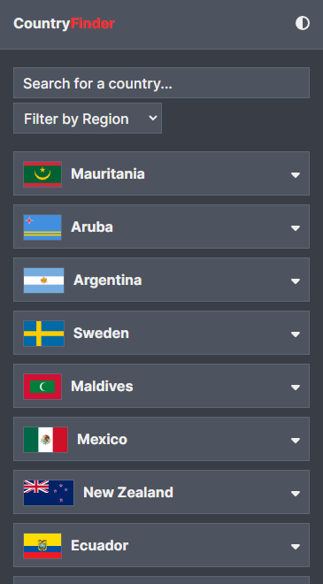

<h1 align="center"> CountryFinder <h1/>

# Links

- Live Site URL: [Click Here](https://country-finder-pearl.vercel.app/)

# Features

- [x] Search country by name
- [x] Filter country by region
- [x] Dark Mode

# Build with

- ReactJS
- Scss
- CSS grid and Flexbox
- Semantic HTML5
- Mobile-First Workflow
